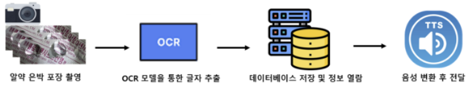

  

 

# [2023 대구를 빛내는 SW 해커톤] 

- 팀명

  - 약박사님을 아세요?

- 제출 타입 및 주제
  
  - S타입, 디지털 활용 능력이 떨어지는 노년층을 대상으로 약의 종류 및 복용 방법에 대한 정보를 쉽게 이해하도록 도와주는 어시스턴트

- 프로젝트 한 줄 설명
  
  - 약 상자 껍데기 없이 약을 보관하여 약의 종류와 복용 방식을 알기 힘든 경우 인공지능을 활용해 이미지와 이미지 내 텍스트를 분석해 어떤 약인지를 알려주는 서비스 

- 프로젝트에 활용된 기술
  
  - PaddleOCR 인공지능 모델 활용 / TTS / 

- 시연 영상
  
  - URL
<!--     
     -->

 

 
 
 

## 1. 주제
- __약박사 (Dr. YAk)__
    - AI 기반 노년층 대상 Drug Assistant
 
 
 

## 2. 핵심 내용
- __핵심 내용__

    - **노년층**이 **약의 종류와 복용 방법** 등에 대한 정보를 쉽게 이해하고 접근할 수 있도록 도와줌

    - __OCR(Optical Character Recognition)__ 모델과 __TTS(Text-To-Speak)__ 를 활용해 사용자는 약의 사진을 카메라로 찍어 입력하고, 해당 약에 대한 이름과 복용 방법에 대한 상세 정보를 획득 할 수 있음

    - 기술 스택

            

    #### 예상 UI Prototype

    

***

- __기술 구현 및 기능 프로세스 설명__

    ### __Framework__

    

    ### __Process__

1. 약포장지의 뒷면 촬영

2. OCR(Optical Character Recognition) 인공지능 모델 활용

    2-1. OCR 텍스트 인식 모델을 통해 약포장지 뒷면의 주요 텍스트 인식 후 문자 추출

    2-2. MultinomialNB 텍스트 분류 머신러닝 모델을 활용해 OCR 모델로 추출한 문자를 특정 약 범주로 텍스트 분류

3.  검증 및 앙상블(Ensemble)을 위한 YOLO Classification 모델 활용 

    3-1. 약포장지 이미지 데이터로 학습된 YOLO Classification 모델을 통해 사용자 입력된 약 이미지 분류

    3-2 텍스트 분류 결과와 이미지 분류 결과에 대한 Weighted soft voting 적용(텍스트 결과 가중치 (0.7), 이미지 결과 (0.3)) 으로 최종 약 결과 분류

4.  앙상블로 최종 분류된 약의 정보(이름, 복용 방법, 주의 사항)를 TTS (Text-To-Speech)를 통해 음성으로 안내

 
 
 

## 3. 제안 배경
1. **노령화 사회의 현실**

    - 한국의 노령화: 2022년 기준 65세 이상 고령자 비율이 16% 이상

    - 전 세계적인 노령화 추세: 2050년까지 65세 이상 인구가 2배 이상 증가 예상

2. **노년층의 의약품 복용률**

    - 노년층은 평균적으로 만성 질환 등으로 인해 여러 종류의 약을 먹는 경우가 많고, 이에 따라 약간의 혼동이나 잘못된 복용이 발생하기 쉬움

3. **노년층의 의약품 인식 문제점**

    - 의약품 포장의 작은 글씨로 인한 정보 인식 어려움

    - 또한, 노년층은 디지털 정보에 접근하는 데 있어 장벽을 느낄 수 있어서 약에 대한 올바른 정보를 얻기 어려울 수 있음

4. **알약 보관 방식**

    - 주로 알약을 보관할 때 약에 대한 상세 정보를 포함하는 상자를 제외하고 은박 알약 포장 형태의 상태로 보관함

    - 해당 보관함에 담은 상태로 알약이 어떤 기능을 위한 것인지 헷갈리는 상황이 생김

        #### 보관 방식의 예시
          
 
 
 

## 4. 사업화 방안 및 기대 효과
- 사업화 방안

    - 병원/약국 파트너십

        - 협력 병원이나 약국과의 파트너십을 구축하여 앱을 홍보하고, 해당 기관에서 추천하는 약에 대한 정보 서비스를 제공함

    - 의약품 데이터베이스 구축 및 판매

        - 의약품 포장재 사진 이미지를 확보하여 의약품 데이터베이스를 구축하여 의료, 의약계 수요자에게 판매

    - 정부 기관과의 연계

        - 사회 복지 서비스에 관한 기술로 활용 가능

***

- 사회 파급(효과)

    - 접근성 향상을 통한 노년층의 약 복용 안전성 향상

        - 약에 대한 정확한 정보 제공을 통해 잘못된 복용이나 부작용 발생의 위험을 줄일 수 있음

        - 디지털 장벽을 낮추는 직관적인 앱 디자인을 통해 노년층의 의약품 정보 접근성을 향상함

    - 의료 서비스와의 연계

        - 병원이나 약국과의 협력을 통해 사용자에게 추가적인 의료 서비스 정보 제공이 가능함

    - 사용자 생활의 편리성 증대

        - 의약품 복용 정보를 쉽게 확인하여 일상에서의 편의성 제공

    - 시장점유율 확대 및 브랜드 가치 상승

        - 타겟 시장을 노년층뿐만 아니라 저시력자 및 약에 대한 지식이 부족한 복용자까지 확장하여 사용자층 확대

    - 사회적 가치 창출

        - 노년층과 저시력자의 생활 품질 향상을 통한 사회적 책임 수행

***

- 기대 효과

    - 사용자의 이용률 증가로 데이터 수집량이 늘어나고, 이에 따른 모델 정확도 상승 및 약의 범주가 확장됨
 
 
이런 방식으로 구축된 앱은 **노년층의 의약품 복용 안전성과 편의성을 향상** 하는 동시에 다양한 사업 모델을 통해 **경제적 이익**도 추구 할 수 있을 것임
 
 
 
## 5. Contribute

 We love your input!

 
 

 
 

