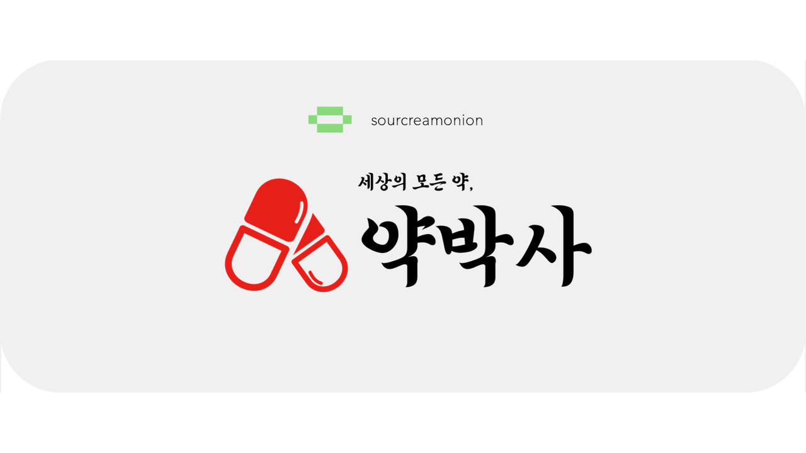
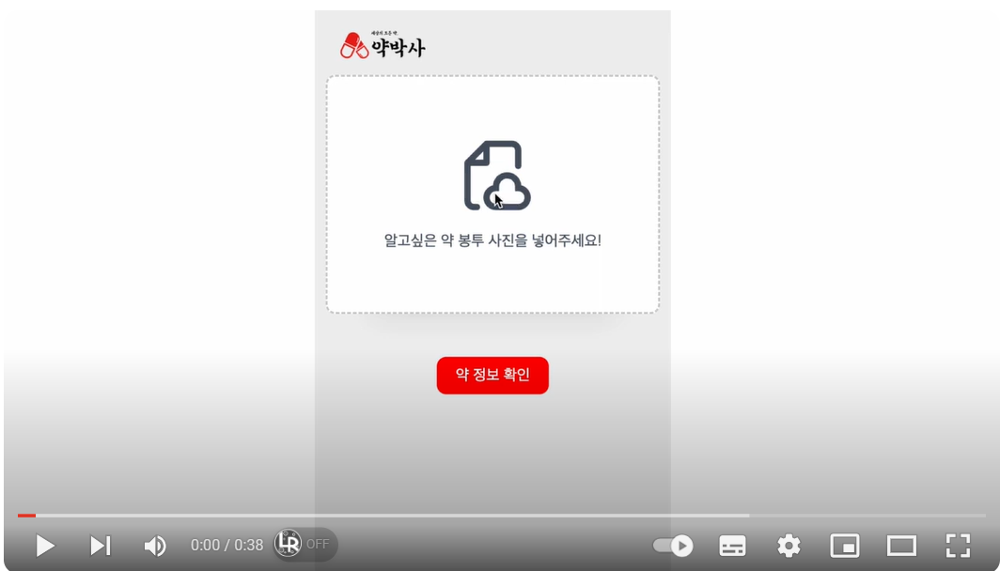
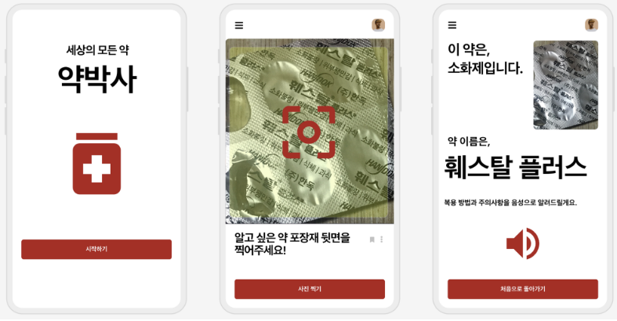

<a href="./asset/figure5.png"></a>

# [Shining Daegu SW Hackathon 2023] 
<a href="./asset/figure7.png"></a>

- Team Name

  - Do you know Dr.Yak?

- Submission type and topic
  
  - S-type, An assistant that helps elder, less digitally literate people easily understand information about medication types and how to take them.

- One-line project description
  
  - A service that uses artificial intelligence to analyze images and text within the images to tell what type of medicine it is when it is difficult to understand the type of medicine and how to take it because the medicine is stored without a box.


- Technologies utilized in the project
  
  - AI models and algorithms based on deep learning
    
  - Text recognition: PaddleOCR / Text analysis: MultinomialNB algorithm / Image classification: YOLO

- Demo ideo (Youtube link)

    [](https://www.youtube.com/watch?v=nV2U9PTMvBE?t=0s) 

<br/>

## Quick Start
- Environment setting (GPU recommed for use)
```
git clone https://github.com/sourcreamonion/Dr.Yak.git
cd Dr.Yak
conda env create -f env.yml
pip install -r requirements.txt
```
<br/>

## 1. Subject
- __Dr. YAk__
  
    - AI-Based Drug Assistant for the Elderly
<br/>
<br/>
<br/>

## 2. Key Content
- __Key Content__

    - **Assisting elderly** in **easily understanding and accessing information** about **types of medication and their usage.**

    - Utilizing **OCR (Optical Character Recognition) and TTS (Text-To-Speak) models**, users can take a photo of the medication with their camera to obtain detailed information about the medication's name and usage.


    - Technology Stack

        <a href="https://www.python.org/"></a> <a href="https://www.w3schools.com/html/"></a> <a href="https://javascript.info/"></a> <a href="https://flask-docs-kr.readthedocs.io/ko/latest/quickstart.html"></a> <a href="https://www.w3schools.com/css/"></a>

    #### Expected UI Prototype

    <a href="./asset/figure1.png"></a>

***

- __Explanation of Technical Implementation and Functional Process__

    ### __Framework__

    <a href="./asset/figure2.png"></a>

    ### __Process__

1. Get the back of a pill wrapper images using smartphone camera.

2. Utilize OCR (Optical Character Recognition) artificial intelligence model.

    2-1. Recognize the main text on the back of the pill wrapper through the OCR text recognition model and extract the characters.

    2-2. Analyze the text extracted by the OCR model into specific drug categories using the MultinomialNB text analysis machine learning model.

3.  Utilize YOLO classification model for validation and ensemble. 

    3-1. Classify user-input medicine images through YOLO classification model trained on medicine package image data.

    3-2. Apply weighted soft voting, one of the ensemble techniques, on text classification results and image classification results (text results weighted (0.7), image results (0.3)) to classify final medicine results.

4.  Voice announcement of the final ensemble classified medicine information (name, how to take, precautions) with text-to-speech (TTS) technology.


<br/>
<br/>
<br/>

## 3. Background
1. **The reality of the aging society**

    - Aging Korea: More than 16% of senior citizens aged 65 and over as of 2022.

    - Global Aging Trends: Over-65 Population Expected to More Than Double By 2050.

2. **The rate of drug use among elder people**

    - Elder people, on average, often take various types of drugs due to chronic diseases, and are more likely to cause some confusion or misadministration.

3. **Problems with drug recognition among elder people**

    - Difficulty in recognizing information due to small letters on pharmaceutical packaging.

    - In addition, elder people may feel barriers in accessing digital information, making it difficult to obtain correct information about the drug.

4. **How to store pills**

    -Mainly when storing pills, keep them in the form of silver foil pill packaging, except in boxes containing detailed information about the medicine.

    - There is a situation where it is confusing what function the pill is for while in the storage box.


        #### Examples of medicine storage  
        <a href="./asset/figure3.png"></a>  
<br/>
<br/>
<br/>

## 4. Commercialization options and expectations
- How to Commercialize

    - Hospital/pharmacy partnership

        - Build a partnership with a collaborating hospital or pharmacy to promote the app and provide information about medications recommended by their organization.

    - Build and sell drug database

        - Build a database of medicines by acquiring photos of drug packaging and selling them to medical and pharmaceutical customers.

    - Cooperation with government agencies

        - Utilize technology for social welfare services.

***

- Social Impact (Effect)

    - Improving medication safety for elder adults through improved accessibility

        - Providing accurate information about medications can reduce the risk of taking them incorrectly or experiencing side effects.

        - Improved access to medication information for elder adults through intuitive app design that reduces digital barriers.

    - Connect with healthcare

        - Collaborate with hospitals and pharmacies to provide additional healthcare information to users.

    - Make life easier for users

        - Provide convenience in daily life by making it easy to check information about taking medication.

    - Expand market share and increase brand value

        - Expanding the target market to include not only the elderly, but also people with low vision and those with limited knowledge of medication..

    - Create social value

        - Fulfill social responsibility by improving the quality of life of the elderly and low-vision people.

***

- What to expect

    - As the amount of data collected expands due to increased user usage, the AI model can be further trained to improve model accuracy and expand the categories of medicines..
  
<br/>
 
Apps built in this way will be able to **improve the safety and convenience of taking medicines for the elderly** while **alsopursuing economic benefitsthrough various business models.**
<br/>
<br/>
<br/>
## 5. Contribute
<div align="center"> We love your input!</div>

<br/>
<br/>
<div align="center"><a href="https://github.com/sourcreamonion/Dr.YaK/graphs/contributors">
  
</a></div>

<br/>
<br/>


